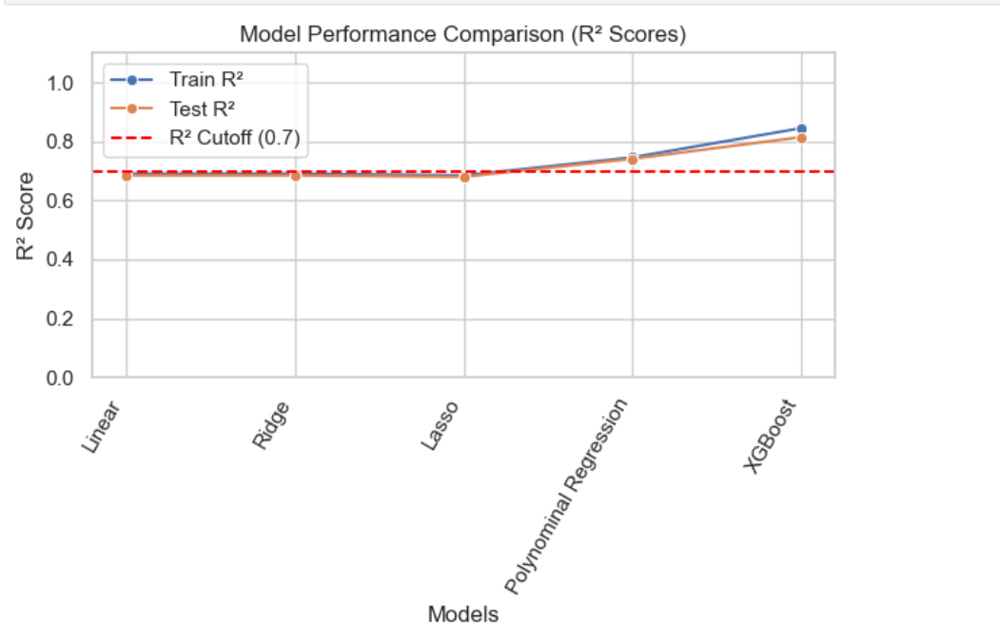

# Engage2Value : From Clicks to Conversions

##  Project Overview

**Engage2Value** aims to **predict a customer’s purchase value** based on **multi-session behavior across digital touchpoints.**

## Dataset Description

Session-level data from a digital commerce platform capturing:

- **User Behavior:** Engagement and session activity (`pageViews`, `totalHits`, etc.).
- **Device Info:** Device type, OS, browser, screen size.
- **Traffic Source:** Channels, campaigns, ad click info.
- **Geography:** City, country, continent, region.
- **Identifiers:** `userId`, `sessionId` for tracking sessions.

 **Target:** `purchaseValue` – total amount spent during the session.

## Key Results

* **XGBoost achieves R² \~0.81 on unseen test data**, outperforming baseline linear models.
* Polynomial regression provides a strong interpretable baseline.

## Model Performance Comparison 

